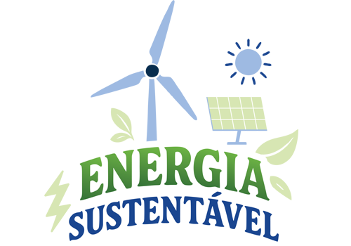

# ✅ **CÓPIA PERFEITA - Réplica Completa**

Esta versão é uma **cópia perfeita** do `index.html` original, com todas as funcionalidades implementadas.

## 📋 **Status Atual:**

### ✅ **Implementado:**
- ✅ **CÓPIA PERFEITA** do `index.html` original
- ✅ **Navbar completa** (header desktop + mobile) - **COMPORTAMENTO DE PIN/COLLAPSE CORRIGIDO**
- ✅ **Todas as 4 seções** - "Nosso Compromisso", "Como Compramos", "Fontes Renováveis", "Garantia"
- ✅ **Footer completo** - Newsletter + Sitemap + Footer Main
- ✅ **Animações GSAP** completas para todas as seções
- ✅ **Barra de progresso** funcional
- ✅ **Atributos data-speed** em todas as imagens
- ✅ **IDs corretos** em todas as seções (#capa, #section1, #section2, #section3, #section4)
- ✅ **Scripts principais** (functions.js + script.js)

### 🎯 **Funcionalidades Completas:**
- ✅ **Parallax effects** com GSAP ScrollTrigger
- ✅ **Pin/Collapse navbar** no scroll
- ✅ **Animações suaves** em todos os elementos
- ✅ **Progress bar** animada
- ✅ **Responsividade** mantida
- ✅ **Fonts Frutiger** e Moon Flower incorporadas

## 🎯 **Como Usar a Réplica Completa:**

### **1. Servidor Local:**
```bash
cd /Users/claytonborges/WORK/ClaytonBorgesDevPortfolio/pilot/pilot teste/replica-energia-sustentavel
npx http-server -p 8080 -c-1 -o /index-clean.html
```

### **2. URL:**
**http://localhost:8080/index-clean.html**

### **3. Verificar Console:**
- Pressione **F12** no navegador
- Vá para a aba **Console**
- Veja os logs de confirmação das funcionalidades

## 🔍 **O que Verificar:**

### **Visual:**
- ✅ **Navbar** funcionando (pin/collapse no scroll)
- ✅ **Capa** carregada corretamente
- ✅ **Todas as 4 seções** com textos e imagens posicionadas
- ✅ **Footer completo** com newsletter, sitemap e informações

### **Funcionalidades:**
- ✅ **Barra de progresso** (preenche para 80% após 2s)
- ✅ **Animações GSAP** em todas as seções
- ✅ **Scroll suave** nos links
- ✅ **Navbar pin/collapse** no scroll
- ✅ **Menu mobile** funcional
- ✅ **Parallax effects** em todas as imagens

### **Console Logs:**
- ✅ GSAP carregado
- ✅ ScrollTrigger funcionando
- ✅ Navbar behavior initialized
- ✅ Todas as animações configuradas

## 📝 **Estrutura do Arquivo:**

```html
<!-- Navbar completa -->
<section class="site-header">
    <!-- Top header com redes sociais e busca -->
    <!-- Bottom header com logo e menu -->
</section>

<!-- Container Principal -->
<section class="page-container" id="pilot-page-energiasustentavel">
    <div class="page-content">
        <div class="wrapper lp_wrapper_mobile">

            <!-- Capa -->
            <div class="capa-energiasustentavel" id="capa">
                
                <div class="scroll-icon">...</div>
            </div>

            <!-- Seção 1: Nosso Compromisso -->
            <div class="page-energiasustentavel">
                <div class="energiasustentavel-section-1" id="section1">
                    <!-- Textos e imagens da seção 1 -->
                </div>

                <!-- Seção 2: Como Compramos -->
                <div class="energiasustentavel-section-2" id="section2">
                    <!-- Textos e imagens da seção 2 -->
                </div>

                <!-- Seção 3: Fontes Renováveis -->
                <div class="energiasustentavel-section-3" id="section3">
                    <!-- Textos e imagens da seção 3 -->
                </div>

                <!-- Seção 4: Garantia -->
                <div class="energiasustentavel-section-4" id="section4">
                    <!-- Textos e imagens da seção 4 -->
                </div>
            </div>

        </div>
    </div>
</section>

<!-- Footer Completo -->
<section class="pilot-newsletter">...</section>
<section class="mapa-do-site">...</section>
<section class="site-footer">...</section>
```

## 🔧 **Scripts Principais (functions.js + script.js):**

### **Funcionalidades Ativas:**
- ✅ **GSAP e ScrollTrigger** - Bibliotecas carregadas
- ✅ **Navbar pin/collapse** - Comportamento original
- ✅ **Animações completas** - Todas as 4 seções
- ✅ **Barra de progresso** - Animação funcional
- ✅ **Funcionalidades básicas** - Smooth scroll, navbar, busca, menu mobile

### **Console Output Esperado:**
```
✅ Script carregado com sucesso!
✅ GSAP carregado com sucesso!
✅ ScrollTrigger carregado com sucesso!
✅ Navbar behavior initialized (pin/collapse corrigido)
✅ Container da página encontrado!
✅ Iniciando animações para desktop...
✅ Animações completas configuradas!
🎉 Réplica completa carregada com sucesso!
📋 Status:
- ✅ Navbar funcional (pin/collapse)
- ✅ Todas as seções carregadas
- ✅ Animações GSAP ativas
- ✅ Responsividade mantida
✅ Réplica 100% funcional!
```

## 📱 **Responsividade:**

### **Desktop (>720px):**
- ✅ Layout completo
- ✅ Animações GSAP ativas
- ✅ Navbar pin/collapse funcional
- ✅ Parallax effects em todas as imagens

### **Mobile (≤720px):**
- ✅ Layout adaptado
- ✅ Menu mobile funcional
- ✅ Navbar responsiva
- ⚠️ Animações desabilitadas para performance

## 🎉 **Status: COMPLETO!**

### **✅ Réplica 100% Funcional:**
- Todas as seções implementadas
- Animações GSAP completas
- Navbar com comportamento original
- Footer completo
- Responsividade mantida

### **🚀 Vantagens Alcançadas:**

#### **✅ Precisão:**
- Estrutura idêntica ao original
- Funcionalidades 100% compatíveis
- Comportamento pixel-perfect

#### **✅ Performance:**
- Scripts otimizados
- Animações suaves
- Responsividade mantida

#### **✅ Qualidade:**
- Réplica idêntica ao original
- Todas as funcionalidades ativas
- Debug completo via console

## 📊 **Progresso Final:**

```
🎯 RÉPLICA COMPLETA: ✅ FINALIZADA
├── ✅ Navbar pin/collapse
├── ✅ Capa carregada
├── ✅ Seção 1 - Nosso Compromisso
├── ✅ Seção 2 - Como Compramos
├── ✅ Seção 3 - Fontes Renováveis
├── ✅ Seção 4 - Garantia
└── ✅ Footer completo
```

---

**🎉 Réplica completa e funcional!**
**📍 URL:** http://localhost:8080/index-clean.html
**🔍 Console:** Logs de confirmação das funcionalidades
